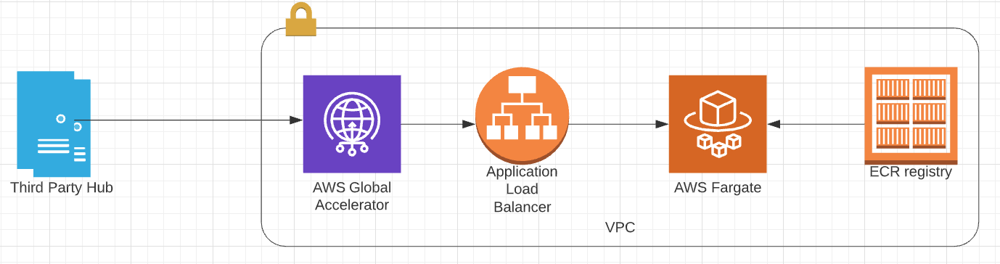
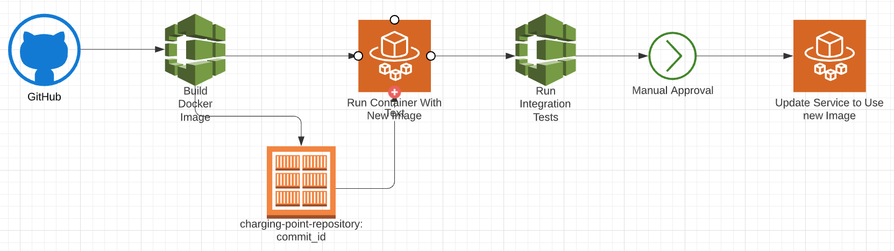

# Venerable Inertia (VNI) Backend

This repository contains an implementation of the environment for running Venerable Inertia backend services.
The backend consists of two services:
1. Charging point backend: Should support up to 100 000 WebSocket connections to charging points. (Referred to as `charging-point-backend` service)
2. REST service for exchanging data with a third party hub. (Refered to as `third-party-backend` service)

This repository also contains a template for creating the deployment pipeline of the Charging Point Backend service.

## Solution Design



One requirement for the solution was to use containerization. Fargate is a native AWS serverless service that allows running Docker containers without having to manage orchestration. From my experience, Fargate is very simple and easy to use. It requires minimum configuration and it's a good option when a service is running a small number of containers.

Elastic Load Balancers provide a single point to reach a service, balance requests, and are serverless & highly scalable. Application Load Balancer seemed to be a good choice since it supports WebSockets. To ensure that the data exchange is secure this solution uses HTTPS with self signed certificates.

In the case of the `third-party-backend` service, there is a need for a static list of IP addresses on which this service can be reached. However, Load Balancers, by design, don't have static IP addresses. This is solved by placing [Global Accelerator](https://us-west-2.console.aws.amazon.com/ec2/v2/home?region=us-west-2#GlobalAcceleratorDashboard:) in front of the Application Load Balancer. Global Accelerator provides static IP addresses on which this service can be reached. Containers that are running the `third-party-backend` service are deployed in a private subnet and they use IP address of NAT Gateways when sending requests to the third party hub. NAT Gateways also have static IPs and therefore the list of whitelisted IPs will not change on either side no matter how many containers this service is running.

## Alternative Solutions

One alternative way of running services in containers could be running and maintaining orchestration platform on EC2 instances, such as Marathon, or using EKS service. This can be a cheaper option since Fargate can get quite expensive, and self managed cluster can allow more fine configuration.

ALB with Global Accelerator is also an expensive solution that could be replaced for example by NGINX Plus. Another reason to replace ALB is the fact that is a very new service with quite limited features, for example, even though it supports WebSockets it doesn't support health checks on WebSockets. Also, Global Accelerator is not yet supported by CloudFormation.

## Deployment Pipeline

With a goal to automate deployment of new versions of services, I built a [CodePipeline](https://eu-west-1.console.aws.amazon.com/codesuite/codepipeline/pipelines/vni-cpo-deployment-pipeline-staging-Pipeline-1KLDR7N5DBLFJ/view?region=eu-west-1) that builds, tests, and deploys containers. The pipeline triggers on a new commit to the master branch of the GitHub repository. The GitHub Token that is used for this is safely stored in Secrets Manager and retreved inside of the CloudFormation template. This pipeline could be useful for deploying to staging or production environments.



Steps of the pipeline:
1. Triggers on new commit to master branch
2. CodeBuilds builds new image for charging-point-backend service, tags it with id of the commit and pushes it to ECR.
3. ECS Deploy component deploys this new image to a test service vni-backend-charging-point-staging-test.
4. Tests can be run agains the deployed test container.
5. Manual Approval of new version of service.
6. charging-point-backend service is updated to use this new Docker image.

## Access To The Environment

AWS IAM users and roles can be used to achieve controlled access and give specific levels of permissions to users.
As an example I implemented 3 types of user groups and deployed example users. [Here](cloudformation/iam.yml)

## Deploying the Environment

1. This project supports deployment of infrastructure in multiple environments.
Use targets in [Makefile](Makefile) to deploy entire backend, infrastructure and services by running:
```AWS_PROFILE=<profile-name> ACCOUNT_ID=<xxxxxx> ENVIRONMENT=<environment> WHITELIST_IP=<hubject-ip> make deploy-backend-services```

NOTE: WHITELIST_IP would be an IP range from which third party hub can reach `third-party-backend` service. This means that `third-party-backend` service will only be accessible from this IP range. You can pass 0.0.0.0/0 or your own IP address if you want to test this service.

2. Global Accelerator is not yet supported by CloudFormation but you can find commands to deploy it using aws cli ip the Makefile under create-global-accelerator.

3. To deploy deployment pipeline:
```AWS_PROFILE=<profile-name> ACCOUNT_ID=<xxxxxx> ENVIRONMENT=<environment> make deploy-delivery-pipeline```


## Developing Testing and Debugging

In the Makefile you will find targets for building and running containers in local(laptop) environment. These commands can be useful for developers as a fast way to run and test their code.

To build a new Docker image with charging-point-backend service run: 
```AWS_PROFILE=<profile-name> ACCOUNT_ID=<xxxxxx> ENVIRONMENT=<environment> build-cp-backend```

To run a container with this image on your laptop:
```AWS_PROFILE=<profile-name> ACCOUNT_ID=<xxxxxx> ENVIRONMENT=<environment> run-cp-backend-locally```

To push the new Docker image to ECR and run it in your environment in the cloud:
```AWS_PROFILE=<profile-name> ACCOUNT_ID=<xxxxxx> ENVIRONMENT=<environment> deploy-cp-backend```

### Test
In charging-point-simulator you can find a simple client for the charging-point-backend service.
Run this client:

```AWS_PROFILE=<profile-name> ACCOUNT_ID=<xxxxxx> ENVIRONMENT=<environment> BACKEND_HOSTNAME=vni-backend-cp-test-1433876008.eu-west-1.elb.amazonaws.com make run-charging-point-simulator```

NOTE: BACKEND_HOSTNAME should be one of the IP addresses that Global Accelerator exposes.

This simple client will connect to the charging-point-backend service in the cloud using WSS protocol and send "Hello" every 5 seconds.

### Debug
Logs from services deployed to the cloud are being written to [CloudWatch Logs](https://eu-west-1.console.aws.amazon.com/cloudwatch/home?region=eu-west-1#logEventViewer:group=/aws/codebuild/vni-backend-staging). This is a first place to look to make sure that charging-point-backend is receiving messages from charging-point-simulator.

In [CloudWatch Metrics](https://eu-west-1.console.aws.amazon.com/cloudwatch/home?region=eu-west-1#metricsV2:graph=~(metrics~(~(~'AWS*2fECS~'MemoryUtilization~'ServiceName~'vni-backend-third-party-staging~'ClusterName~'vni-cpo-staging~(visible~false))~(~'.~'CPUUtilization~'.~'.~'.~'.)~(~'.~'MemoryUtilization~'.~'vni-backend-charging-point-staging~'.~'.~(visible~false))~(~'.~'CPUUtilization~'.~'.~'.~'.))~period~300~stat~'Average~region~'eu-west-1~start~'-PT12H3M~end~'P0D~view~'timeSeries~stacked~false);query=~'*7bAWS*2fECS*2cClusterName*2cServiceName*7d) you will find data about CPU and MEM usage of services. It's good to keep an eye on these metrics and it's also recommended to set alarms that will alert you when containers are running out of these resources.

